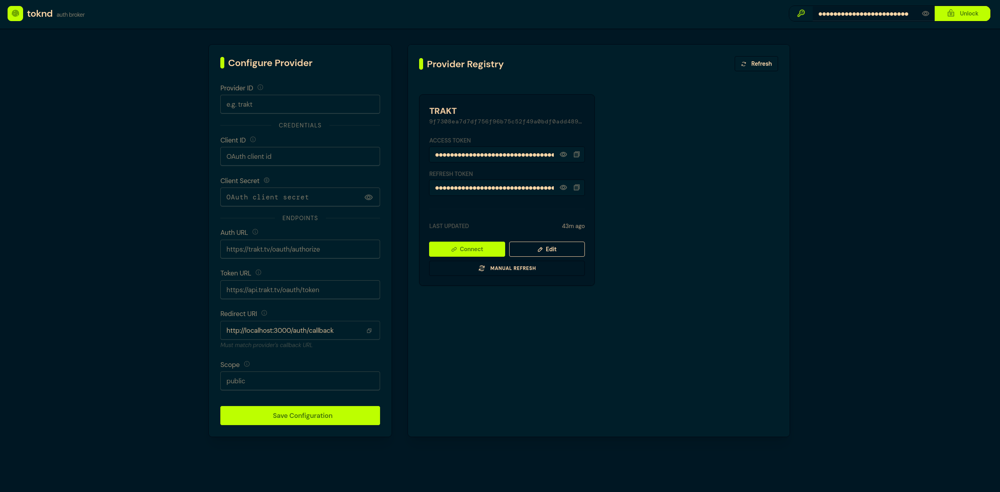

# toknd — The Minimal Token Broker



Building integrations is fun until you have to manage the tokens. Suddenly, you're writing cron jobs to handle refresh cycles, dealing with expired sessions in the middle of background tasks, and copying OAuth secrets manually across multiple microservices.

If you are building AI agents that need to take actions in the real world, the absolute last thing you want is your LLM trying to debug an OAuth redirect flow.

**toknd** is a minimal, centralized authentication and auth token broker and middleware. Built with **Bun**, **Hono**, and **Redis**, it acts as a secure "wallet" that sits between your applications and the external APIs they need to access.

You just need to authenticate once. toknd manages the lifecycle of the tokens forever.

---

## Why does this exist?

There are massive enterprise identity brokers (like Auth0 or Dex), and then there are reverse proxies (like oauth2-proxy). **toknd** is built to bridge the gap while remaining minimal and open-source. It provides the lightweight, developer-friendly infrastructure of a proxy, but with the specific "Token Vault" capabilities required for modern AI and microservice architectures—without the bloat, vendor lock-in, or SaaS costs.

## Use-Cases
- **The Ultimate AI Agent Wallet:** Equip your autonomous agents with a secure keychain. When your agent needs to hit a service backed by oauth, like GitHub or Notion API, it just asks toknd for a token. It gets a short-lived Bearer token instantly, keeping your permanent secrets completely isolated from dynamic AI environments.
- **Set It and Forget It:** toknd handles automated background refreshes. Your data ingestion pipelines, RAG syncs, and headless integration workers will never stall out due to a `401 Unauthorized` error again.
- **Microservice Centralization:** Stop implementing OAuth in every new service. Centralize your credentials so your microservices only need one internal API key to request valid access tokens for any configured provider.
- **Secure Secret Isolation:** OAuth client IDs, secrets, and long-lived refresh tokens stay locked inside toknd's Redis vault, drastically reducing your attack surface. All you need to do is secure the store.

## Features

- **Drop-in Infrastructure:** Deploys in seconds via Docker (or Podman) Compose or just a simple Bun script.
- **Centralized Provider Management:** Native support for managing multiple OAuth2 providers (Google, GitHub, Trakt, etc.).
- **API Key Security:** Isolated and secure access to the broker via master API keys. Each instance can use its own key for isolation.
- **Web Dashboard:** Built-in clean ad modern UI for managing provider configurations and viewing live token statuses.
- **Blisteringly Fast:** Powered by Bun and Redis for ultra-low latency token retrieval.

## Tech Stack

- **Runtime**: [Bun](https://bun.sh/)
- **Web Framework**: [Hono](https://hono.dev/)
- **Data Store**: [Redis](https://redis.io/)
- **Styling**: [Tailwind CSS](https://tailwindcss.com/) & [DaisyUI](https://daisyui.com/)
- **Schema & Validation**: [Zod](https://zod.dev/)
- **Docs**: [Scalar](https://github.com/scalar/scalar)

---

## Getting Started

toknd is designed to be too easy to set-up. You can deploy it as a containerized service or host it directly on bare metal.

### 1. Environment Setup
Clone the repository and set up your environment:
```bash
git clone https://git.ramvignesh.dev/toknd_auth.git
cd toknd
cp .env.example .env
```
Open `.env`, define your own strong `API_KEY`, and map the ports (optional)

### 2. Choose Deployment Method

#### Option A: Docker Compose (Recommended)
The easiest way to get up and running. This spins up both toknd and a dedicated Redis instance.

You can run toknd by building the container locally or by pulling the pre-built image from the **GitHub Container Registry (GHCR)**.

##### Using Pre-built Image (GHCR)
Instead of building locally, you can pull the pre-built image. Update the `app` service in `docker-compose.yml` to pull the image:

```yaml
services:
  app:
    image: ghcr.io/ramvignesh-b/toknd:latest
    # build: .  # Comment or remove this line
```

Then start the services:
```bash
docker compose up -d
(or)
podman compose up -d
```

##### Building from Source
If you prefer to build the image locally:
```bash
docker compose up -d --build
(or)
podman compose up -d --build
```


#### Option B: Bare Metal
If you already have Bun and Redis running in your environment.

1. **Install Dependencies**:
   ```bash
   bun install
   ```
2. **Start the Server**:
   - **Production**: `bun run start`
   - **Development**: `bun run dev`

   *Note: Make sure your Redis server is running and accessible via the `HOST` and `PORT` in your `.env`.*

---

## Usage & API Reference

toknd provides a built-in **Scalar API Reference** so you can explore and test endpoints right from your browser.

- **Interactive UI**: [http://localhost:3000/api](http://localhost:3000/api) (or `/docs`)
- **OpenAPI Spec**: [http://localhost:3000/doc](http://localhost:3000/doc)

### The Golden Rule
All protected endpoints require your master API key in the Authorization header:
```http
Authorization: Bearer <your_master_api_key>
```

### The Dashboard
REST API too complicated to use? No problem!
You absolutely don't have to manage everything via curl. Access the web dashboard to configure providers, trigger manual refreshes, and monitor token health:
**`http://localhost:3000/app`**

*(Authenticate using your Master API Key).*

---

## Contributing

This is an open-source passion project built to solve a real headache in modern application architecture. Pull requests, issues, and feature requests (especially for new built-in OAuth providers!) are highly encouraged.

## License

MIT
